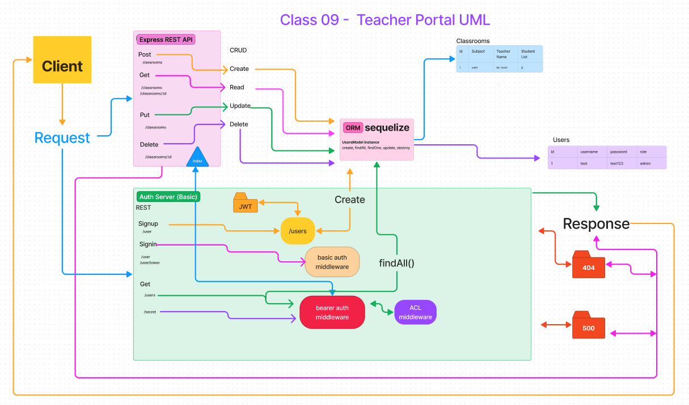

# LAB - Class 09

## Project: Teacher Portal

### Authors

[Eva Grace Smith](https://github.com/EvaGraceSmith)

[Francisco Sanchez](https://github.com/c0d3cisco)

### Problem Domain

* Create a new application using API Server and Authentication Systems.

Our team's responsibility was to plan, execute, and present an application that demonstrates a Content Management System (CMS) with comprehensive RESTful CRUD operations. This application aims to simplify the workflow for teachers and administrators by providing them with efficient tools to manage various functions. By streamlining the interactions with necessary CMSs, our goal is to save valuable time for teachers and faculty, allowing them to dedicate more effort towards benefiting the students.

### Links and Resources

* [GitHub Actions ci/cd](https://github.com/EvaGraceSmith/teacherportal)
* [Back-end deployment](https://teacher-portal.onrender.com)

### Collaborators

* Mark Smith

### Setup

#### How to initialize/run your application (where applicable)

 

1. Clone this repository to a location of your choosing. In the terminal, navigate to the directory and run the following commands:
2. `npm i` to install dependencies
3. **Copy** the `.env.sample` file and rename it to `.env`, then **update** the `.env` file with your `PORT` and `DATABASE_URL`
4. Run `db:config` to create the `config.json` file
5. **Update** the "username" in `config.json` with your PostgreSQL username and set the "dialect" to "postgres"
6. Run `db:create` to create the database
7. Run `nodemon` to start the server
8. Use Thunder Client to utilize API functionality with the routes listed below

#### Features / Routes

 

>>The project is currently in its early stages, and its capabilities are limited. At this point, administrators can only perform basic operations such as reading, updating, and deleting user records that have been created.

 

* Create a User - `POST` method: `/signup` - sends a JSON object with the properties of username, password, and role ('student', 'teacher', or 'admin') to the database. The database will return a JSON object with the properties of id, username, password, role, capabilities, token, and createdAt.
* Sign in - `POST` method: `/signin` - sends a JSON object with the properties of username and password to the database. The database will return a JSON object with the properties of id, username, password, role, capabilities, token, and createdAt.
* Update a User (must be signed in with admin account and have bearer token) - `PUT` method: `/users/:id` - sends a JSON object and the bearer token with the properties of username, password, and role ('student', 'teacher', or 'admin') to the database. The database will return an array with a value of 1 if successful.
* Delete a User (must be signed in with admin account and have bearer token) - `DELETE` method: `/users/:id` - send the request with the bearer token to the database. The database will return with a value of 1 if successful.
* Get all Users (must be signed in with admin account and have bearer token) - `GET` method: `/users` - send the request with the bearer token to the database. The database will return an array of all users.

#### Tests

* Run `npm test` to execute the tests.

#### UML

 

